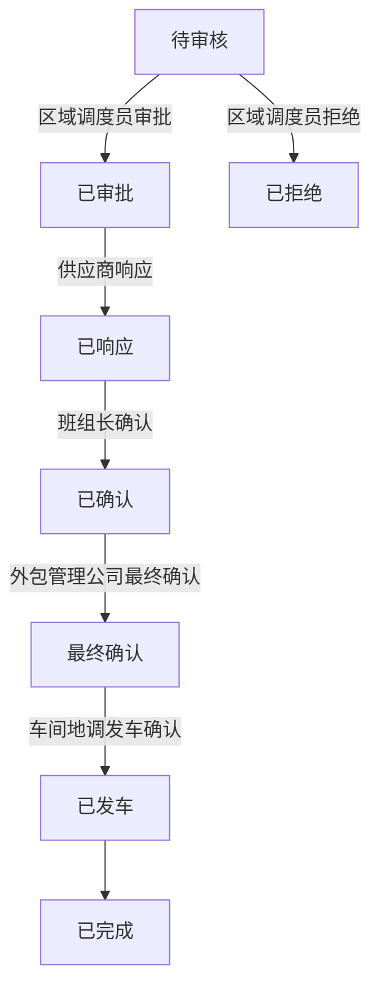

# 任务详情页面架构设计文档

## 系统架构
采用分层架构设计，确保功能模块化和可维护性。

### 1. 组件架构
```
TaskDetail.vue (父组件)
├── OverviewCard (任务概览卡片)
├── StatusAlert (状态提示栏)
├── DetailGrid (详情网格)
├── ActionButtons (操作按钮组)
├── VehicleGrid (车辆信息)
└── TimelineContainer (状态历史)
```

### 2. 状态管理
```typescript
interface TaskDetailState {
  task: TaskDetail
  currentUserRole: UserRole
  availableActions: Action[]
  nextStepInfo: NextStepInfo
}

interface Action {
  key: string
  label: string
  type: ButtonType
  permission: string
  condition: (task: Task) => boolean
}
```

### 3. 角色权限映射
```typescript
const roleActions = {
  'regional_dispatcher': ['approve', 'reject'],
  'supplier': ['respond'],
  'team_leader': ['confirm'],
  'outsourcing_manager': ['final_confirm'],
  'workshop_dispatcher': ['depart_confirm']
}
```

### 4. 样式架构
- **设计系统**：基于Element Plus的定制主题
- **色彩方案**：
  - 主色：#1e3c72 → #2a5298（蓝色渐变）
  - 辅助色：状态对应的颜色系统
  - 中性色：灰度色系
- **布局系统**：
  - 12列网格系统
  - 卡片式布局
  - 响应式断点：768px、1024px、1440px

### 5. API接口设计
```typescript
// 获取任务详情
GET /api/dispatch/tasks/:id

// 获取用户角色
GET /api/auth/user/role

// 任务操作
POST /api/dispatch/tasks/:id/action
{
  action: 'approve' | 'reject' | 'respond' | 'confirm' | 'final_confirm' | 'depart_confirm',
  comment?: string,
  attachments?: File[]
}
```

### 6. 状态流转


### 7. 组件通信
- 使用provide/inject进行跨层级通信
- 事件总线处理全局状态更新
- Props/Events处理父子组件通信

### 8. 错误处理
- 权限不足：显示友好提示
- 网络错误：重试机制
- 状态冲突：乐观更新 + 回滚机制